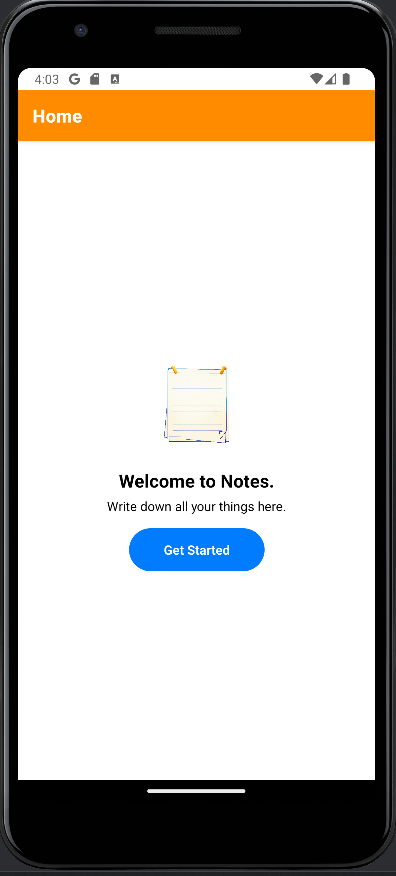
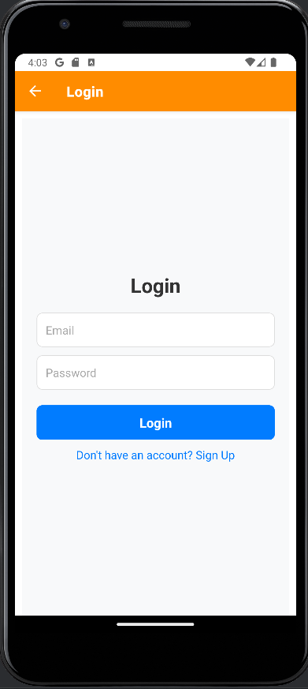
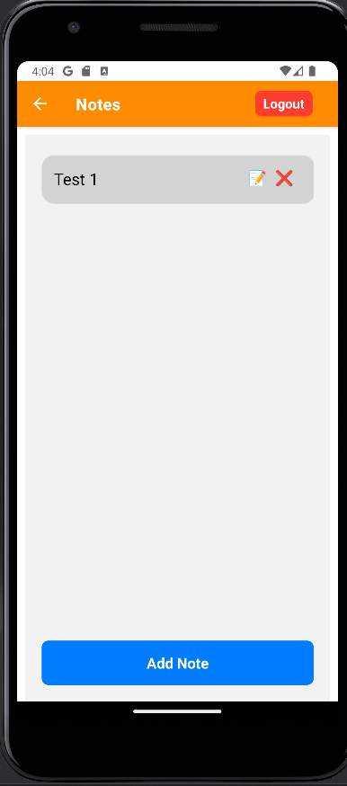

# 📝 Notes - A Simple Note-Taking App



A clean and intuitive note-taking application built with HTML, CSS, and JavaScript. Easily create, edit, and manage your notes with a responsive design that works across devices.

## ✨ Features

- **Add New Notes** - Quickly create notes with titles and content
- **Edit Existing Notes** - Modify your notes anytime
- **Responsive Design** - Works on desktop, tablet, and mobile
- **Local Storage** - Notes are saved in your browser
- **Clean UI** - Minimalist interface focused on your content

## 👟 How to run
- Clone the repository:
   ```bash
   git clone https://github.com/MohamedImran7868/Notes.git
  ```
- open terminal or VSCode on the cloned path
- Run 
```bash
   npm start
  ```
- A Qr Code will be generated. Scan with ur phone using Expo GO or run on sdk
